Create a DynamoDB table books

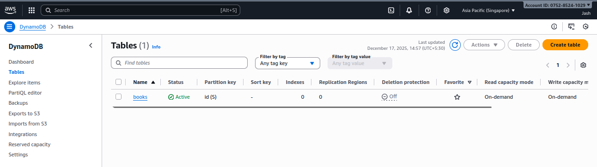{width="6.260416666666667in"
height="1.75in"}

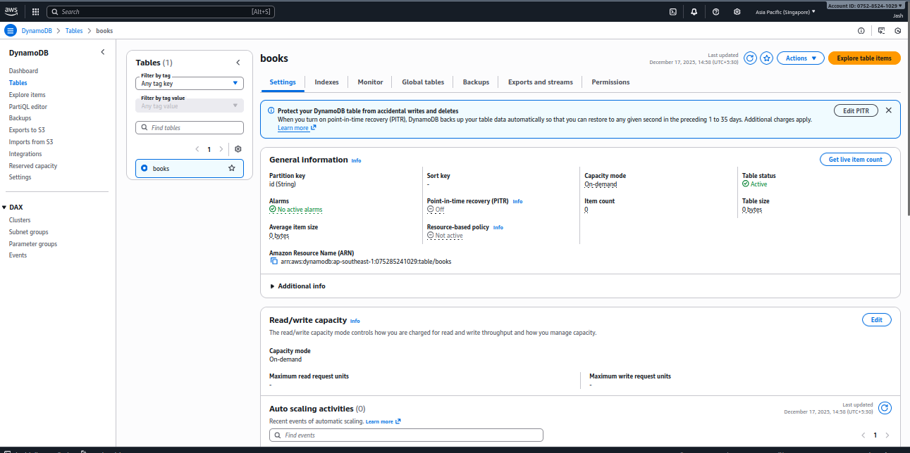{width="6.260416666666667in"
height="3.125in"}

Create a lambda-role for execution and access dynamo db

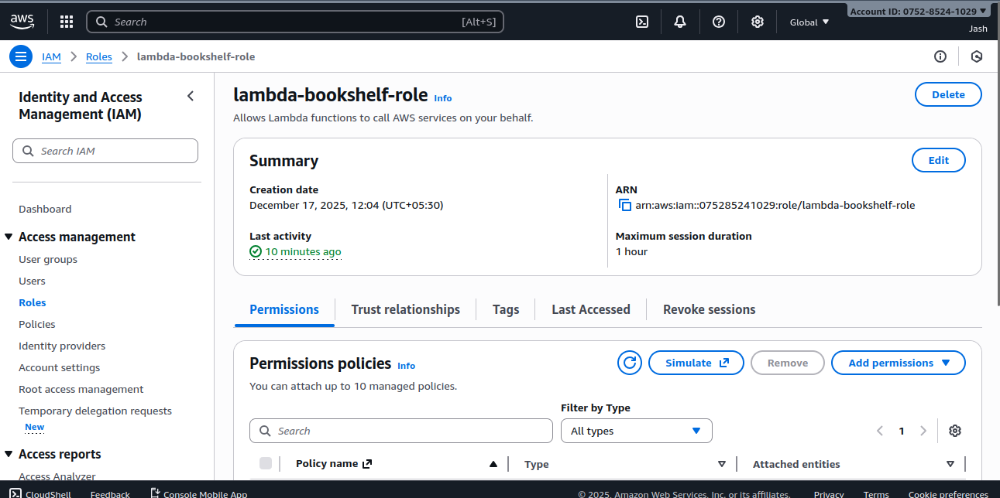{width="6.260416666666667in"
height="3.125in"}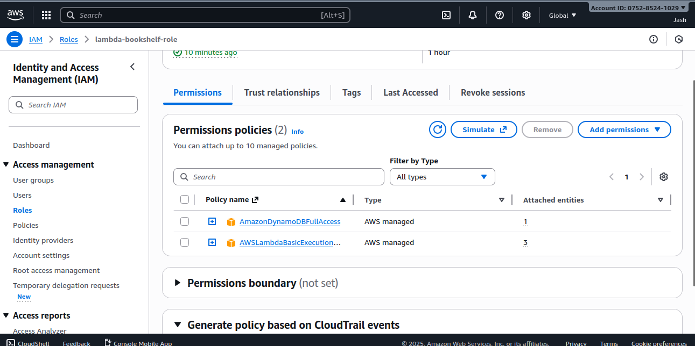{width="6.260416666666667in"
height="3.125in"}

Create Lambda functions:

a\. Add item

b\. Get item

c\. List items

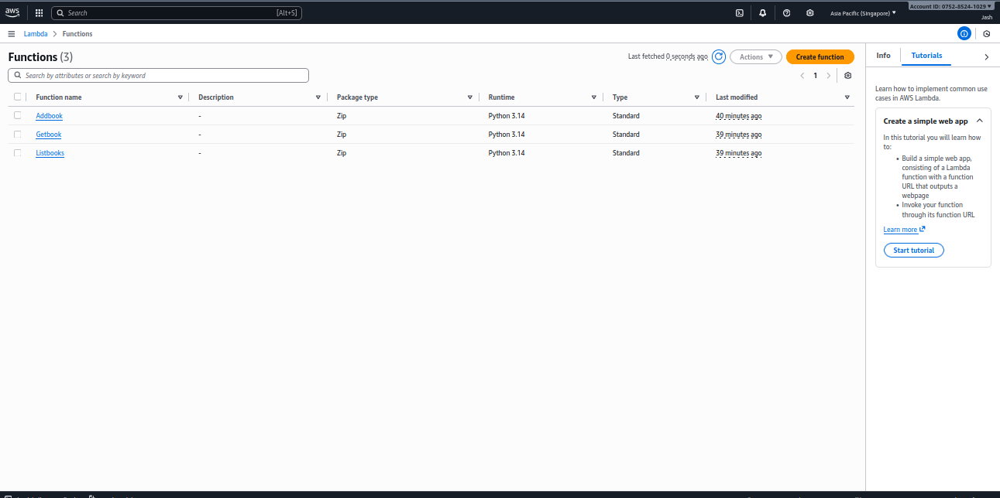{width="6.260416666666667in"
height="3.125in"}

Create an API gateway

Create an HTTP API

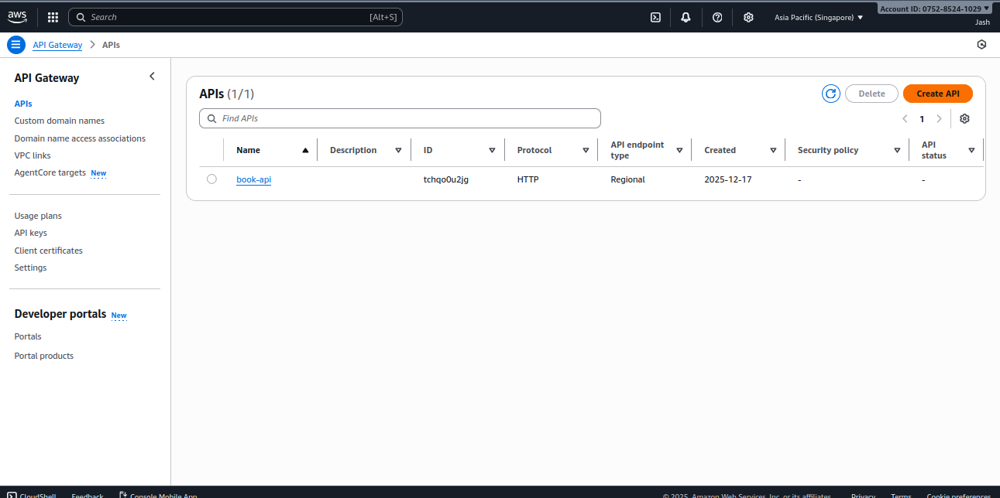{width="6.260416666666667in"
height="3.125in"}

Create Stage

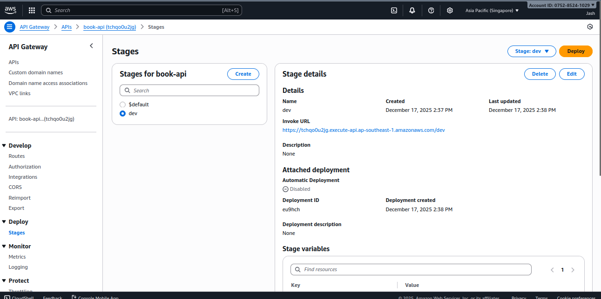{width="6.260416666666667in"
height="3.125in"}

Create Routes

POST /book

Get/books

Get/books/{id}

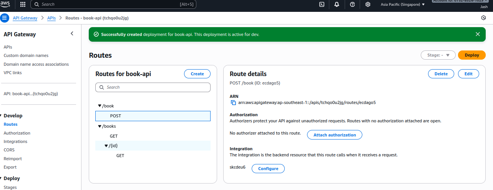{width="6.260416666666667in"
height="2.4270833333333335in"}

Adding book to our dynamo db using below command

curl -X POST
<https://tchqo0u2jg.execute-api.ap-southeast-1.amazonaws.com/dev/book>
\\

-H \"Content-Type: application/json\" \\

-d \'{\"title\": \"My First Book\", \"author\": \"Jash Shah\"}\'

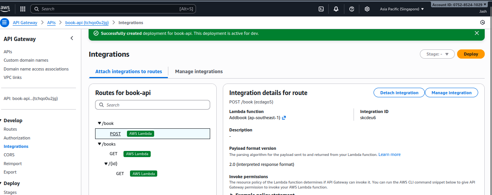{width="6.260416666666667in"
height="2.4791666666666665in"}

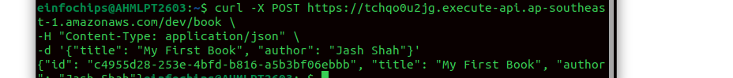{width="6.260416666666667in"
height="0.6666666666666666in"}

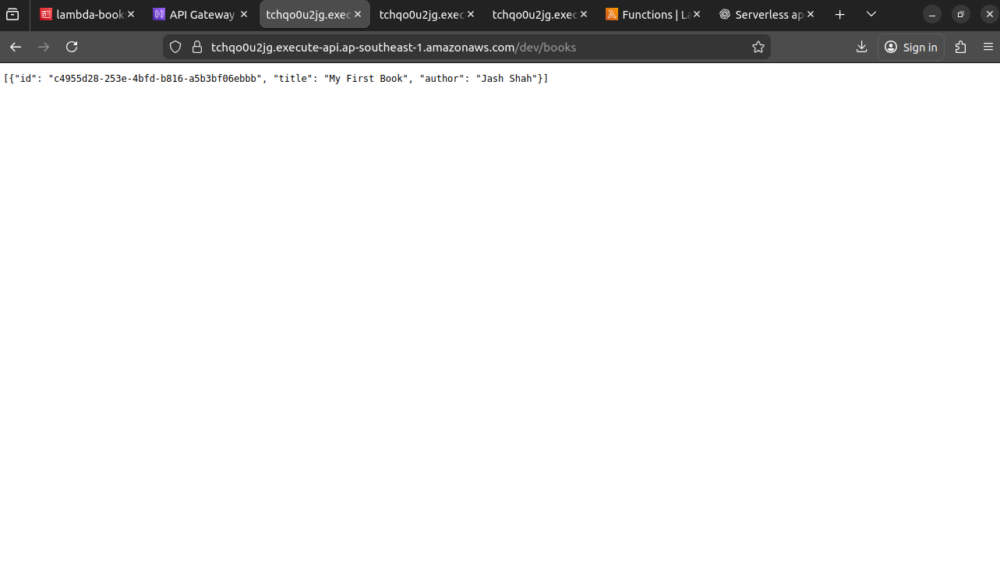{width="6.260416666666667in"
height="3.5416666666666665in"}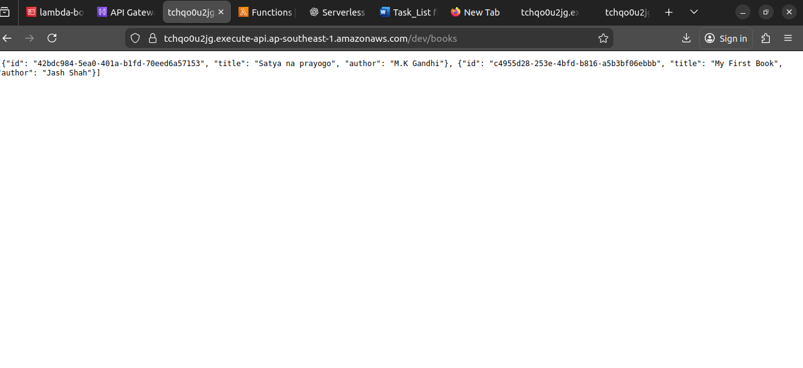{width="6.260416666666667in"
height="2.875in"}

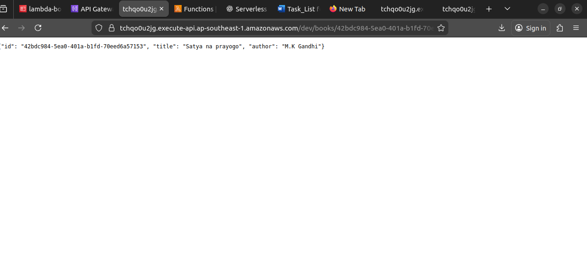{width="6.260416666666667in"
height="2.875in"}

Lambda functions

# **Addbook**
```bash
import json

import boto3

import uuid

dynamodb = boto3.resource(\'dynamodb\')

table = dynamodb.Table(\'books\')

def lambda_handler(event, context):

body = json.loads(event\[\'body\'\])

if \'title\' not in body or \'author\' not in body:

return {

\'statusCode\': 400,

\'body\': json.dumps({\'message\': \'title and author are required\'})

}

item = {

\'id\': str(uuid.uuid4()),

\'title\': body\[\'title\'\],

\'author\': body\[\'author\'\]

}

table.put_item(Item=item)

return {

\'statusCode\': 200,

\'body\': json.dumps(item)

}
```
# **Getbook**
```bash
import json

import boto3

dynamodb = boto3.resource(\'dynamodb\')

table = dynamodb.Table(\'books\')

def lambda_handler(event, context):

book_id = event\[\'pathParameters\'\]\[\'id\'\]

response = table.get_item(Key={\'id\': book_id})

if \'Item\' not in response:

return {

\'statusCode\': 404,

\'body\': json.dumps({\'message\': \'Book not found\'})

}

return {

\'statusCode\': 200,

\'body\': json.dumps(response\[\'Item\'\])

}
```
# **Listbooks**
```bash
import json

import boto3

dynamodb = boto3.resource(\'dynamodb\')

table = dynamodb.Table(\'books\')

def lambda_handler(event, context):

response = table.scan()

items = response.get(\'Items\', \[\])

return {

\'statusCode\': 200,

\'body\': json.dumps(items)

}
```
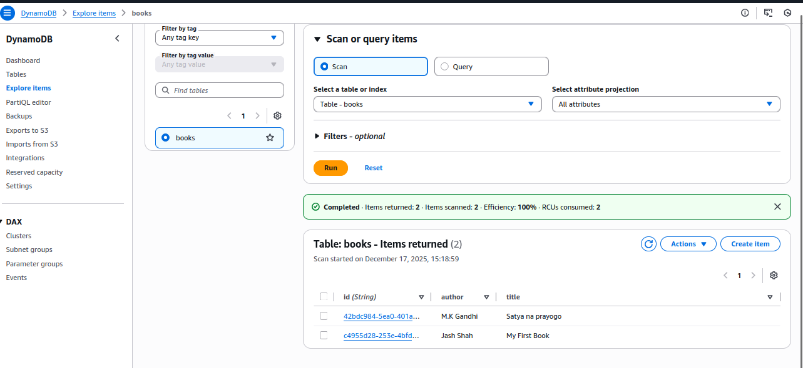{width="6.260416666666667in"
height="2.875in"}
