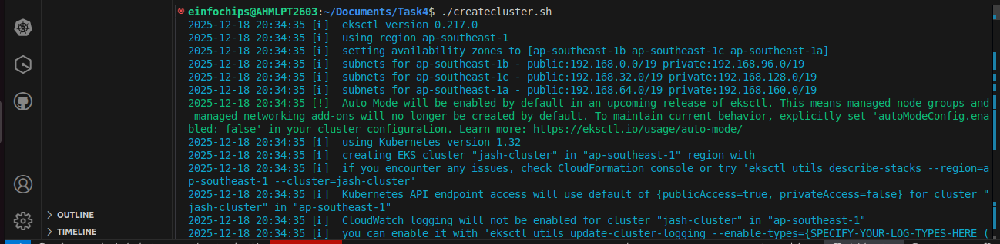
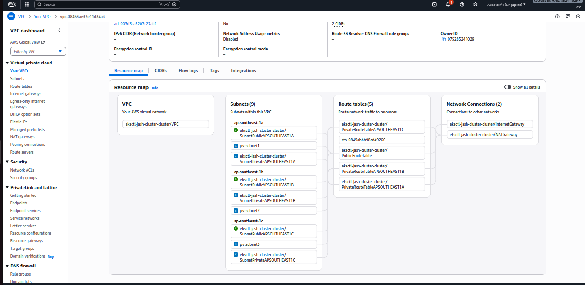
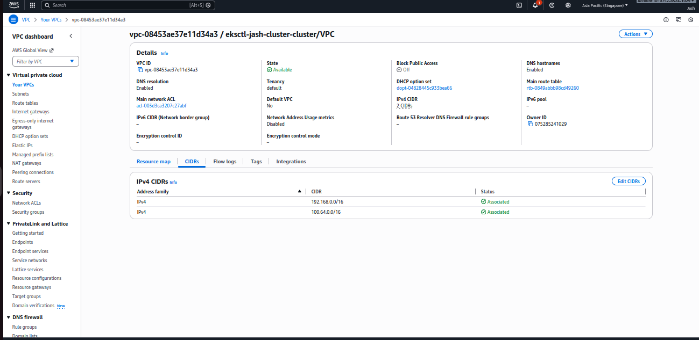
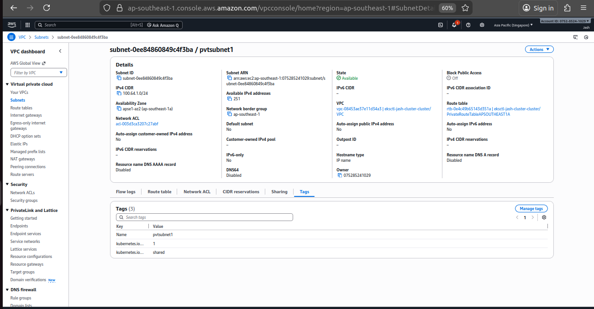
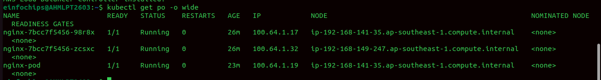
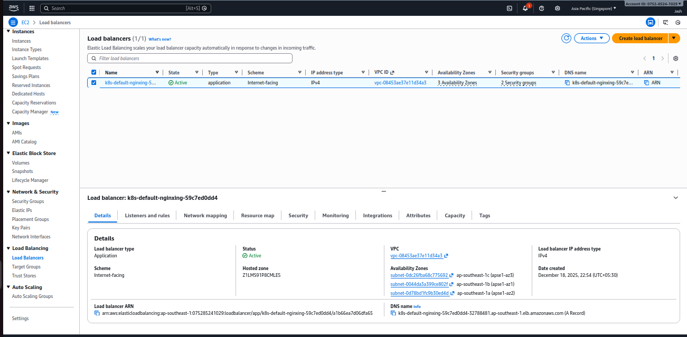
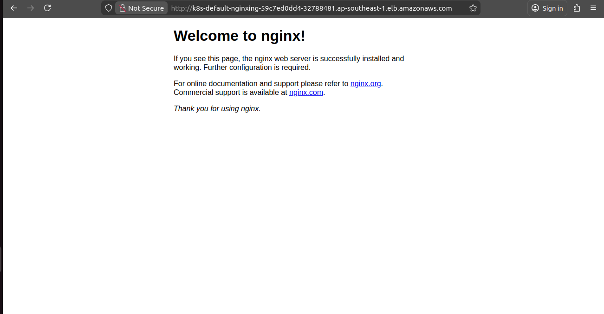
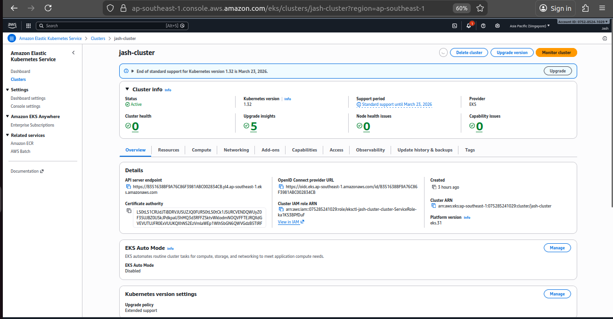
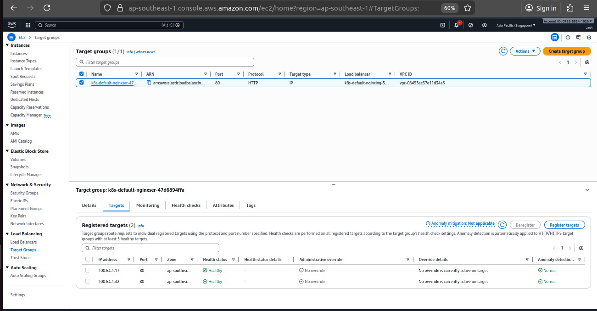

# Production-Ready Amazon EKS Cluster with Private Nodes and Public ALB

## Overview

This task focuses on building a **production-ready Amazon EKS cluster** where worker nodes run entirely in **private subnets**, and external access to applications is handled securely through a **public Application Load Balancer (ALB)**.

The setup follows AWS best practices for security, scalability, and networking by isolating compute resources while still allowing controlled public access.

---

## Prerequisites

Before proceeding, ensure the following requirements are met:

- An active **AWS Account**
- IAM user or role with permissions for:
  - EKS
  - EC2
  - VPC
  - IAM
  - Elastic Load Balancing
- AWS CLI configured with appropriate credentials
- `eksctl` installed
- `kubectl` installed and configured
- Basic understanding of:
  - Kubernetes concepts (Pods, Services, Ingress)
  - Amazon EKS architecture
  - VPC, subnets, route tables, and NAT Gateways
- Familiarity with AWS Load Balancer Controller

---

# Task 4: Build a Production-Ready EKS Cluster (Private Nodes + Public ALB)

## Architecture Diagram

The following diagram represents the overall architecture of the EKS cluster with private worker nodes and a public-facing ALB:

---

## EKS Cluster Creation

- Create an Amazon EKS cluster using `eksctl`
- The control plane is managed by AWS
- No public IPs are assigned to worker nodes

---

## Networking Configuration (VPC)

A custom VPC is used to ensure full control over networking and subnet isolation.

---

## Custom VPC CIDR

- A custom CIDR block is assigned to the VPC
- Ensures proper IP address planning and avoids CIDR overlap

---

## Custom Private Subnet Creation

- Additional **private subnets** are created
- These subnets are dedicated for pod networking using custom VPC CNI configuration

---

## Subnet Tagging

- Subnets are tagged appropriately for:
  - EKS cluster discovery
  - Load balancer usage
- Required for AWS Load Balancer Controller and Kubernetes integration

---

## VPC CNI Custom Networking (Secondary ENIs)

- Elastic Network Interfaces (ENIs) are deployed
- Pods receive IP addresses from the custom private subnets
- Improves IP management and network isolation

After restarting the required components, pods begin receiving IPs from the newly created subnets.

---

## AWS Load Balancer Controller Installation

- AWS Load Balancer Controller is installed in the cluster
- Required IAM roles and policies are configured
- Enables Kubernetes Ingress resources to provision ALBs automatically

---

## Application Deployment

- Kubernetes Services are created
- All required manifest files are applied
- Application pods run in private subnets without public exposure

---

## Ingress Configuration

- Kubernetes Ingress resources are applied
- A **public Application Load Balancer** is automatically provisioned
- Routes external traffic securely to services running in private subnets

---

## Conclusion

This setup demonstrates a production-grade Amazon EKS architecture where:

- Worker nodes and pods run in private subnets
- Public access is strictly controlled through an ALB
- Networking follows AWS best practices
- The cluster is scalable, secure, and ready for real-world workloads

This architecture is suitable for enterprise-grade Kubernetes deployments requiring high availability and strong network isolation.