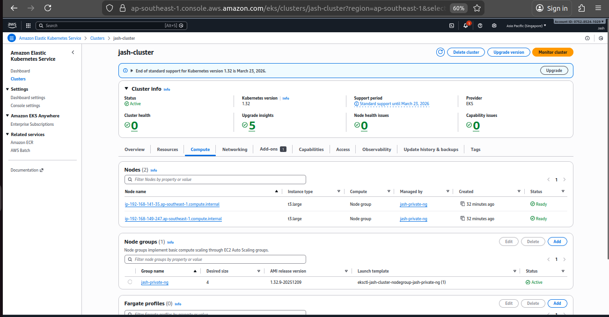
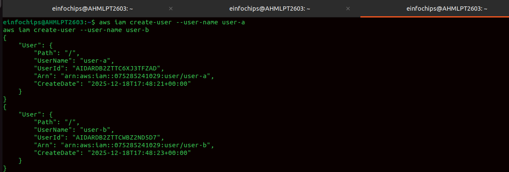
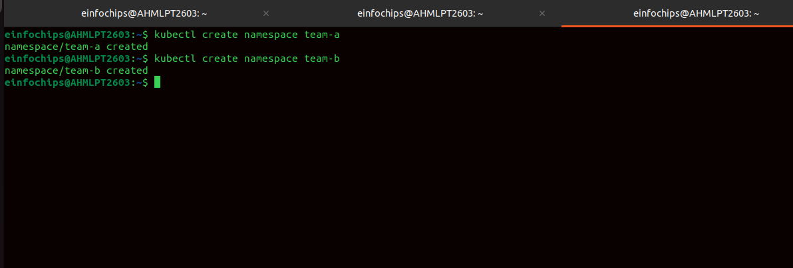
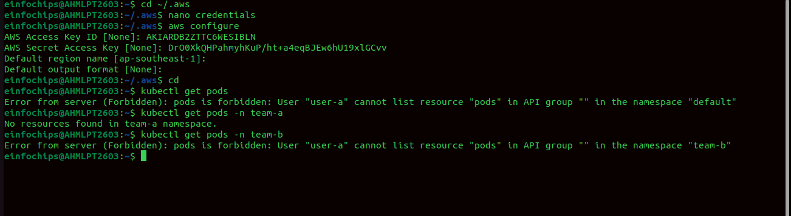
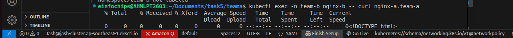
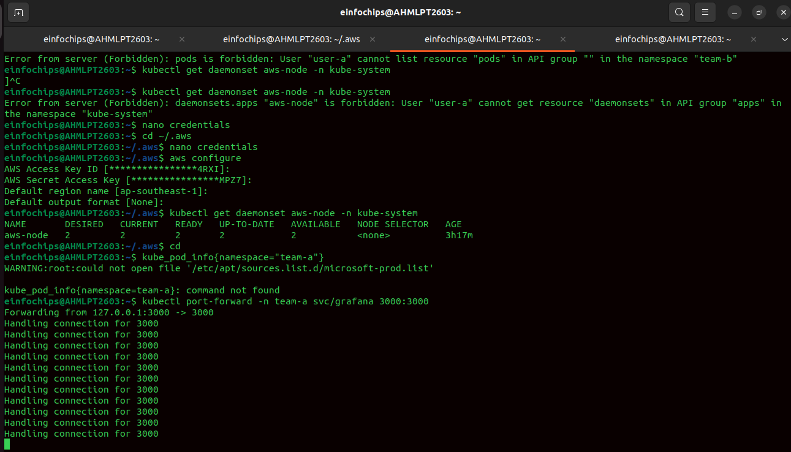
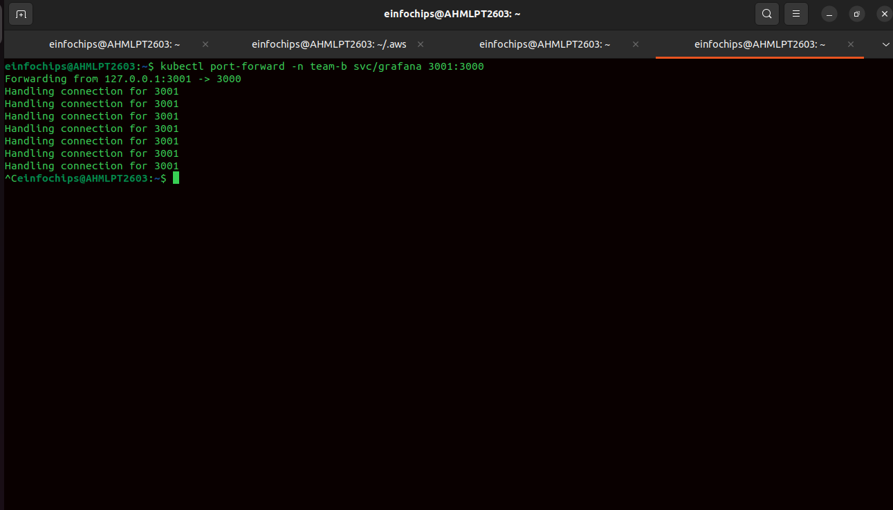
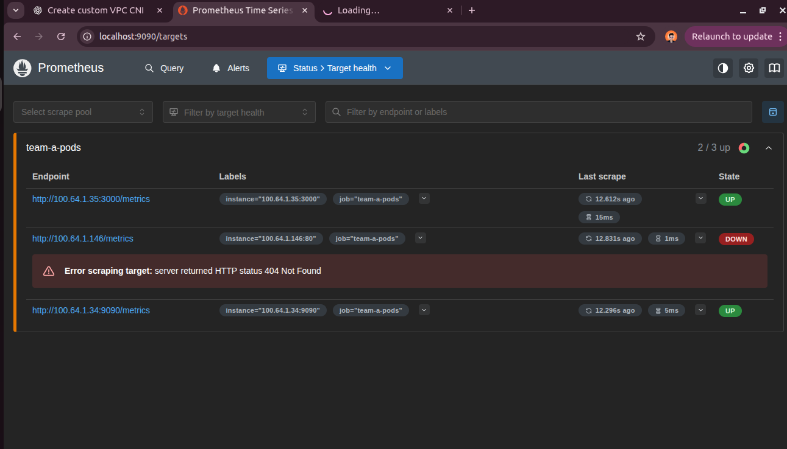
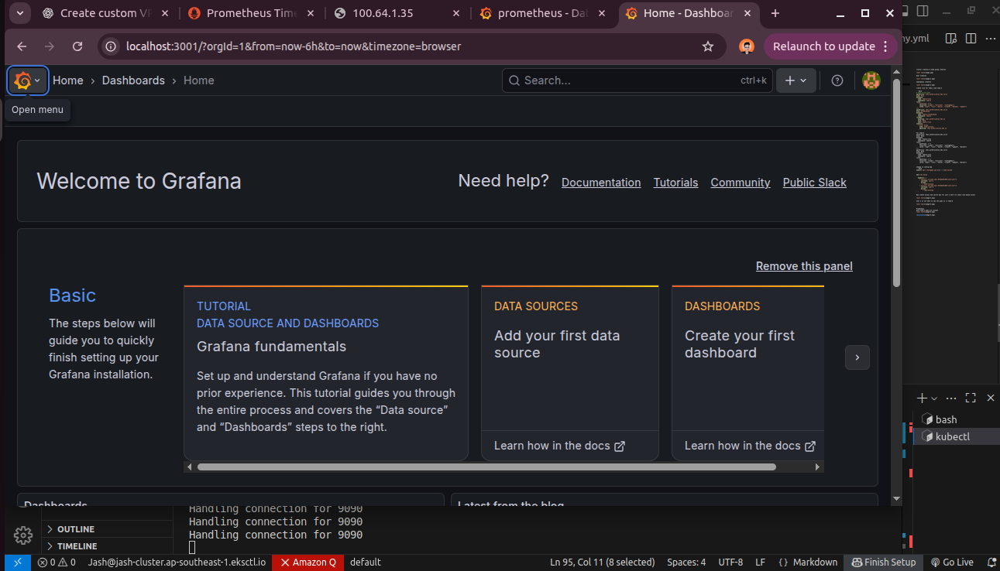
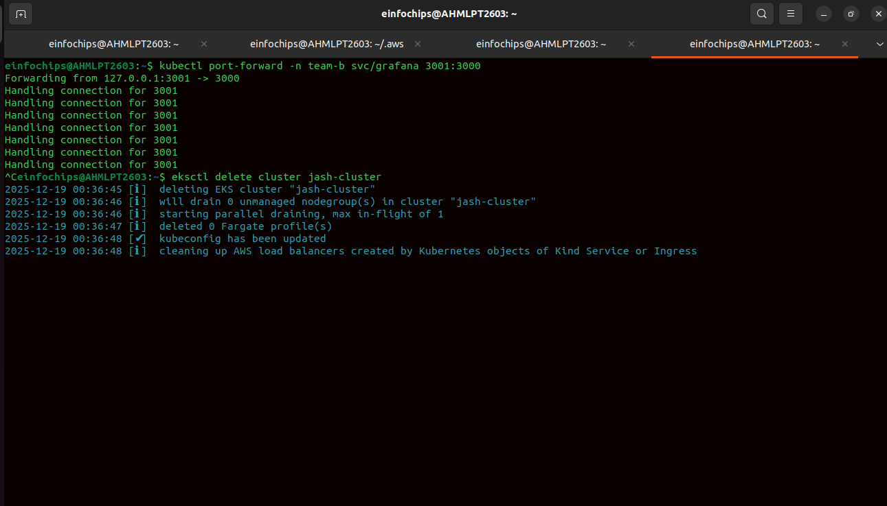

# Multi-Tenant Amazon EKS Cluster with RBAC and Namespace Isolation

## Overview

This task demonstrates how to implement **multi-tenancy in Amazon EKS** using **Kubernetes namespaces, RBAC (Role-Based Access Control), and IAM integration**.  
Two teams (Team A and Team B) are isolated at the namespace level, ensuring secure and controlled access to Kubernetes resources.

Monitoring access is also validated using **Prometheus**, confirming visibility restrictions based on roles.

---

## Prerequisites

Before starting, ensure the following:

- An active **AWS Account**
- IAM permissions for:
  - EKS
  - EC2
  - IAM
- AWS CLI configured
- `eksctl` installed
- `kubectl` installed and configured
- Basic understanding of:
  - Kubernetes namespaces
  - RBAC (Role, RoleBinding)
  - AWS IAM users and policies
  - Amazon EKS authentication (`aws-auth` ConfigMap)

---

## Cluster and Node Group Creation

- Create an EKS cluster
- Create managed node groups for worker nodes
- Verify cluster and node readiness



---

## IAM User Creation

- Create separate IAM users for:
  - **User A (Team A)**
  - **User B (Team B)**
- These users will be mapped to Kubernetes RBAC groups



---

## Namespace Creation

- Create isolated namespaces for each team:
  - `team-a`
  - `team-b`



---

## RBAC Configuration

### Team A Role and RoleBinding

```yaml
# team-a-role.yaml
apiVersion: rbac.authorization.k8s.io/v1
kind: Role
metadata:
  name: team-a-role
  namespace: team-a
rules:
  - apiGroups: [""]
    resources: ["pods", "services", "configmaps"]
    verbs: ["get", "list", "watch", "create", "delete", "update"]
---
apiVersion: rbac.authorization.k8s.io/v1
kind: RoleBinding
metadata:
  name: team-a-rolebinding
  namespace: team-a
roleRef:
  apiGroup: rbac.authorization.k8s.io
  kind: Role
  name: team-a-role
subjects:
  - kind: Group
    name: team-a-group
    apiGroup: rbac.authorization.k8s.io
```

---

### Team B Role and RoleBinding

```yaml
apiVersion: rbac.authorization.k8s.io/v1
kind: Role
metadata:
  name: team-b-role
  namespace: team-b
rules:
  - apiGroups: [""]
    resources: ["pods", "services", "configmaps"]
    verbs: ["get", "list", "watch", "create", "update", "delete"]
---
apiVersion: rbac.authorization.k8s.io/v1
kind: RoleBinding
metadata:
  name: team-b-rolebinding
  namespace: team-b
roleRef:
  apiGroup: rbac.authorization.k8s.io
  kind: Role
  name: team-b-role
subjects:
  - kind: Group
    name: team-b-group
    apiGroup: rbac.authorization.k8s.io
```

---

## AWS Auth ConfigMap Update

Update the `aws-auth` ConfigMap to map IAM users to Kubernetes RBAC groups.

```bash
kubectl edit configmap aws-auth -n kube-system
```

Add the following under `mapUsers`:

```yaml
mapUsers: |
  - userarn: arn:aws:iam::075285241029:user/user-a
    username: user-a
    groups:
      - team-a-group
  - userarn: arn:aws:iam::075285241029:user/user-b
    username: user-b
    groups:
      - team-b-group
```

---

## Access Key Creation and Validation

- Create **Access Key** and **Secret Key** for both User A and User B
- Configure AWS CLI profiles for each user
- Validate namespace-level access



---

## RBAC Validation

- User A cannot view resources in `team-b` namespace
- Access is strictly limited to assigned namespaces



---

## Monitoring with Prometheus

- Prometheus is deployed in the cluster
- Visibility is restricted based on RBAC permissions
- Only Team A pods are visible to Team A users










---

## Clean-Up

- Delete namespaces
- Remove IAM users and access keys
- Delete RBAC roles and role bindings
- Tear down EKS cluster and node groups



---

## Conclusion

This implementation demonstrates a secure multi-tenant EKS architecture using:

- Kubernetes namespaces for isolation
- RBAC for fine-grained access control
- IAM integration via `aws-auth` ConfigMap
- Monitoring validation with Prometheus

This approach is suitable for enterprise Kubernetes environments with multiple teams sharing a single EKS cluster securely.