# Automatic Inventory of AWS Resources in a Region

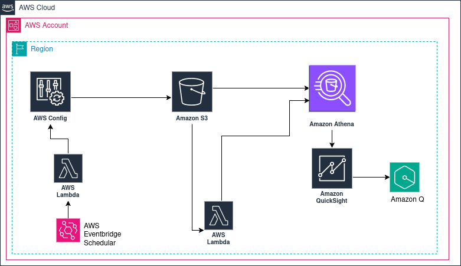

## Overview

This project demonstrates how to automatically inventory AWS resources within one or more AWS Regions using AWS Config, Amazon S3, AWS Glue, Amazon Athena, Amazon QuickSight, and Amazon Q.

AWS Config periodically collects configuration and compliance data for supported AWS resources across target accounts and Regions. This data is delivered to a centralized Amazon S3 bucket. Whenever new AWS Config data is delivered, it can trigger an AWS Lambda function to process and organize the data for analytics.

The processed data is queried using Amazon Athena, visualized using Amazon QuickSight dashboards, and explored interactively using Amazon Q.

---

## Architecture Flow

1. AWS Config records configuration snapshots and compliance data.
2. Data is delivered to a centralized Amazon S3 bucket.
3. Amazon S3 events or scheduled triggers invoke AWS Lambda.
4. Lambda partitions the data by Region and date for efficient querying.
5. AWS Glue provides schema metadata for the data.
6. Amazon Athena runs SQL queries on the data stored in S3.
7. Athena views extract curated datasets.
8. Amazon QuickSight visualizes the data using interactive dashboards.
9. Amazon Q enables natural language queries on top of QuickSight datasets.

---

## AWS Services Used

- AWS Config   
- Amazon S3  
- AWS Lambda  
- AWS EventBridge  
- AWS Glue  
- Amazon Athena  
- Amazon QuickSight  
- Amazon Q  

---

## AWS Config Setup

Configure AWS Config to deliver configuration snapshots to a destination S3 bucket.

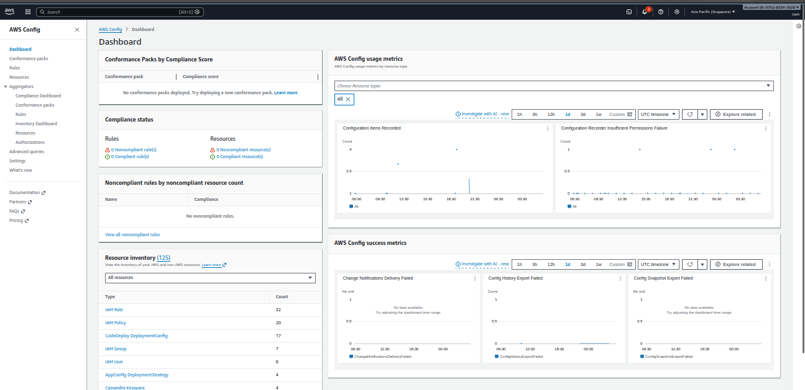

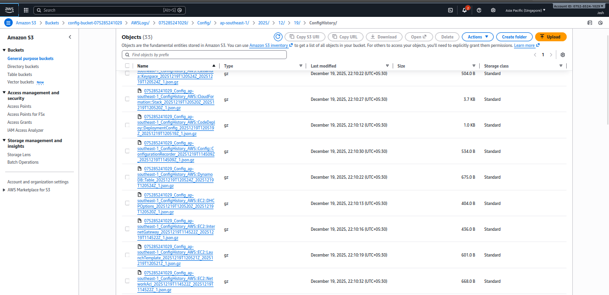

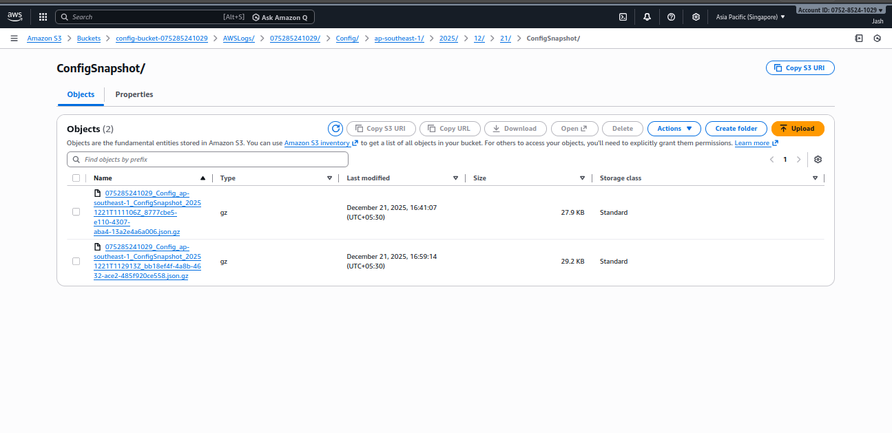

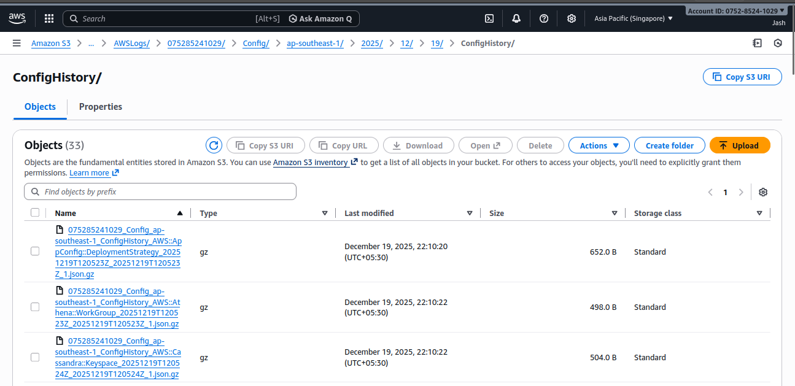


### Manual Snapshot Delivery (CLI)

```bash
aws configservice deliver-config-snapshot --delivery-channel-name "YOUR-DELIVERY-CHANNEL-NAME"
```

This command triggers an on-demand configuration snapshot delivery to the configured S3 bucket.

---

## Automating Daily Snapshots

To automate snapshot delivery on a daily basis:

- Create an AWS Lambda function to trigger AWS Config snapshots.
- Create an Amazon EventBridge rule to invoke the Lambda function on a schedule.

### EventBridge and Lambda Setup


Create an IAM role & policy for lambda execution and attach while creation of lambda

IAM policy has below minimum requirement

```bash
{
  "Version": "2012-10-17",
  "Statement": [
    {
      "Effect": "Allow",
      "Action": [
        "config:DeliverConfigSnapshot",
        "config:DescribeDeliveryChannels"
      ],
      "Resource": "*"
    },
    {
      "Effect": "Allow",
      "Action": [
        "logs:CreateLogGroup",
        "logs:CreateLogStream",
        "logs:PutLogEvents"
      ],
      "Resource": "*"
    }
  ]
}
```

then  create lambda function to deliver snapshots daily

```bash
import boto3
import os

def lambda_handler(event, context):
    config_client = boto3.client("config")

    delivery_channel_name = os.environ.get(
        "DELIVERY_CHANNEL_NAME",
        "default"
    )

    try:
        response = config_client.deliver_config_snapshot(
            deliveryChannelName=delivery_channel_name
        )
        return {
            "statusCode": 200,
            "message": "AWS Config snapshot delivery triggered successfully",
            "response": response
        }
    except Exception as e:
        return {
            "statusCode": 500,
            "error": str(e)
        }
```


Create an Eventbridge rule to invoke the lambda function daily

Go to Amazon EventBridge

Select Scheduleer
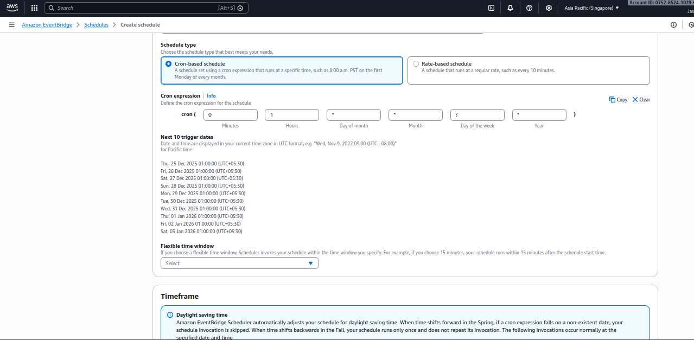

Use the cron expression above

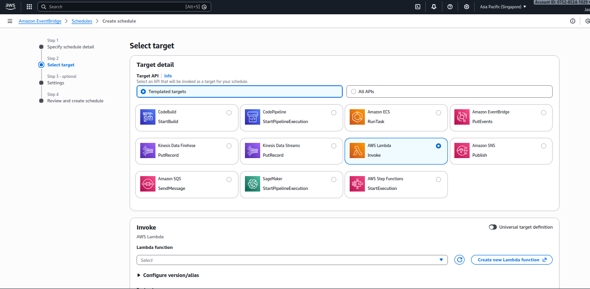

Target → Lambda function

Select your snapshot Lambda

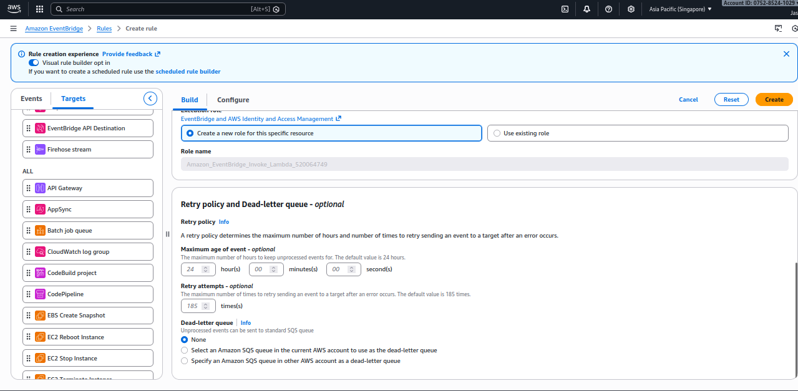


---

## Athena Configuration

### Create Database

```sql
CREATE DATABASE aws_config;
```

### Create External Table

```sql
CREATE EXTERNAL TABLE aws_config_configuration_snapshots (
  configurationitems ARRAY<STRUCT<
    configurationitemversion: STRING,
    configurationitemcapturetime: STRING,
    configurationitemstatus: STRING,
    accountid: STRING,
    resourcetype: STRING,
    resourceid: STRING,
    resourcename: STRING,
    arn: STRING,
    awsregion: STRING,
    availabilityzone: STRING,
    configurationstatemd5hash: STRING,
    resourcecreationtime: STRING,
    tags: MAP<STRING, STRING>,
    configuration: STRING,
    supplementaryconfiguration: MAP<STRING, STRING>,
    relatedevents: ARRAY<STRING>,
    relationships: ARRAY<STRUCT<
      resourceid: STRING,
      resourcename: STRING,
      resourcetype: STRING,
      name: STRING
    >>
  >>
)
ROW FORMAT SERDE 'org.openx.data.jsonserde.JsonSerDe'
WITH SERDEPROPERTIES ('ignore.malformed.json' = 'true')
STORED AS INPUTFORMAT 'org.apache.hadoop.mapred.TextInputFormat'
OUTPUTFORMAT 'org.apache.hadoop.hive.ql.io.HiveIgnoreKeyTextOutputFormat'
LOCATION 's3://config-bucket-075285241029/AWSLogs/075285241029/Config/ap-southeast-1/';
```

---

## Athena Views

### EC2 Instances View

```sql
CREATE OR REPLACE VIEW config_ec2_instances AS
SELECT
  item.resourceid AS instance_id,
  item.resourcename AS instance_name,
  item.arn,
  item.awsregion AS region,
  item.availabilityzone AS availability_zone,
  item.configurationitemcapturetime AS capture_time,
  item.tags,
  json_extract_scalar(json_parse(item.configuration), '$.instanceType') AS instance_type,
  json_extract_scalar(json_parse(item.configuration), '$.imageId') AS ami_id,
  json_extract_scalar(json_parse(item.configuration), '$.state.name') AS instance_state,
  json_extract_scalar(json_parse(item.configuration), '$.vpcId') AS vpc_id,
  json_extract_scalar(json_parse(item.configuration), '$.subnetId') AS subnet_id,
  json_extract_scalar(json_parse(item.configuration), '$.privateIpAddress') AS private_ip,
  json_extract_scalar(json_parse(item.configuration), '$.publicIpAddress') AS public_ip,
  item.resourcecreationtime AS launch_time
FROM aws_config_configuration_snapshots
CROSS JOIN UNNEST(configurationitems) AS t(item)
WHERE item.resourcetype = 'AWS::EC2::Instance';
```

### List All Resources

```sql
SELECT
  item.resourcetype,
  item.resourceid,
  item.arn,
  item.configurationitemcapturetime
FROM aws_config_configuration_snapshots
CROSS JOIN UNNEST(configurationitems) AS t(item)
ORDER BY item.configurationitemcapturetime DESC;
```

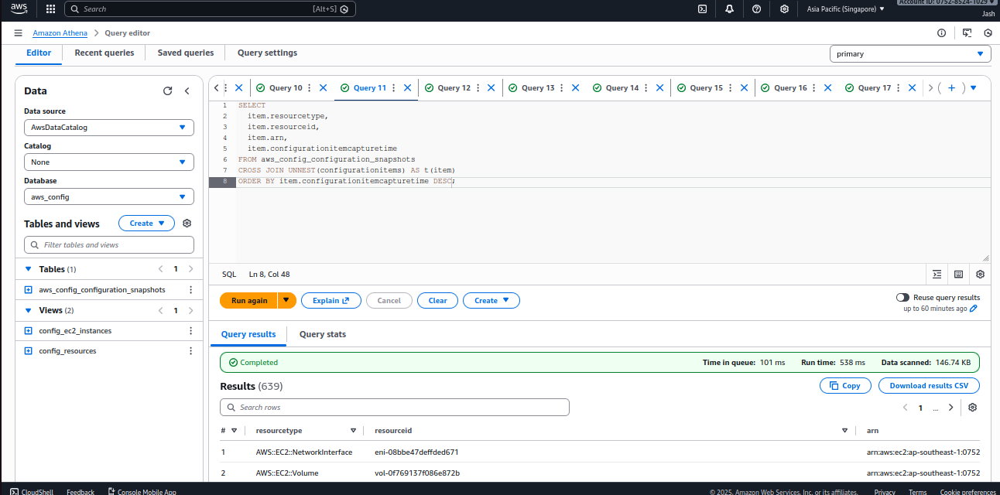

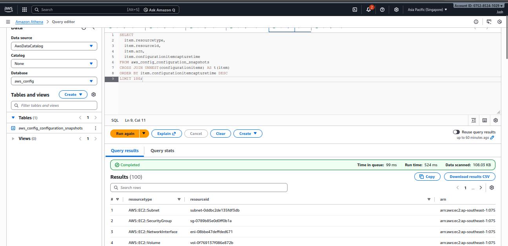

---

## Amazon QuickSight Setup

1. Navigate to Amazon QuickSight.
2. Go to **Manage QuickSight** and grant access to S3 and Athena using 
3. Create a new data source.
4. Select Athena as the source and choose the appropriate database and tables.

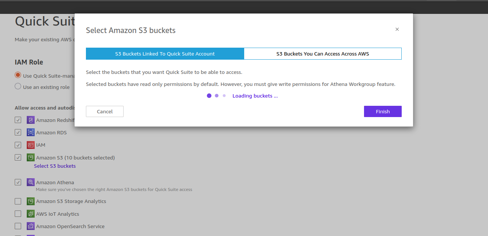
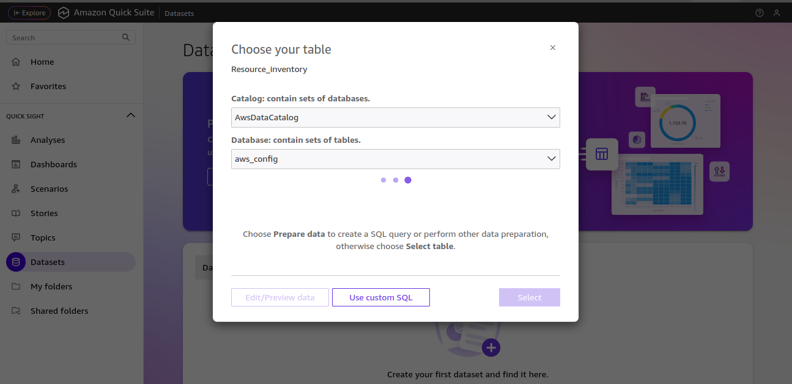
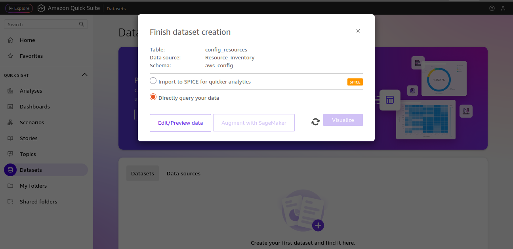

### Dashboards

Create interactive dashboards to visualize resource inventory.

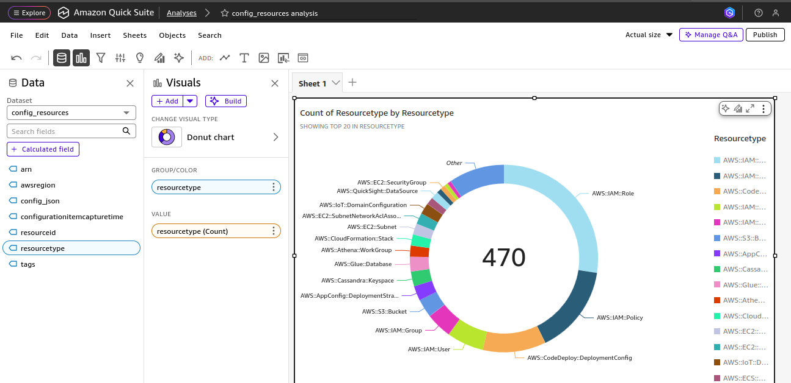
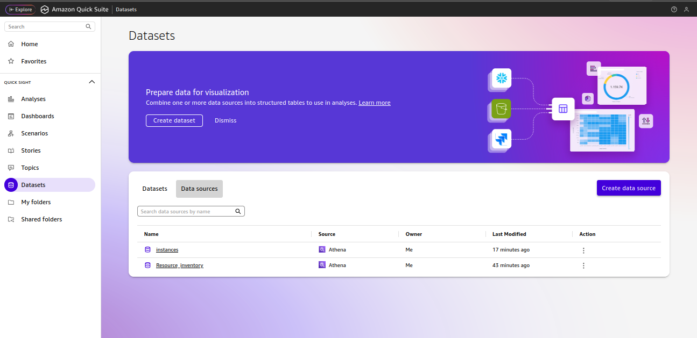
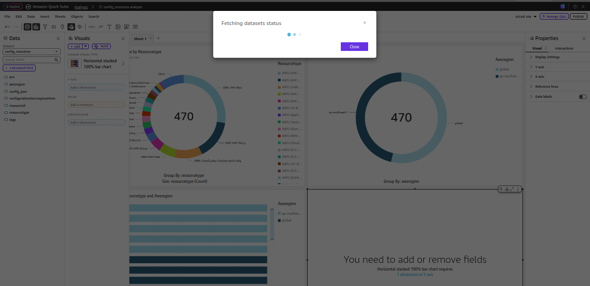
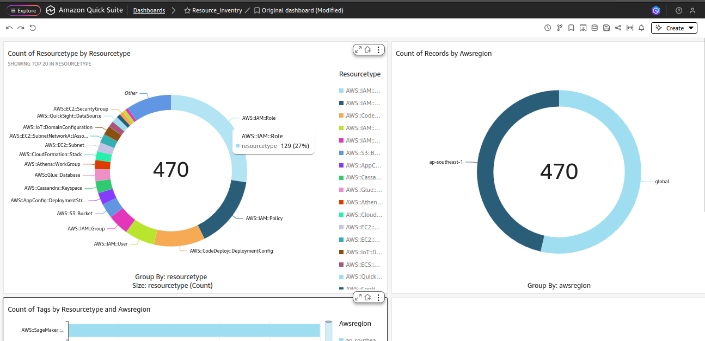

Region resource visibility is supported.

---

## Amazon Q Integration

To use Amazon Q with QuickSight:

1. Navigate to **Topics** in QuickSight.
2. Create a topic using your dataset.

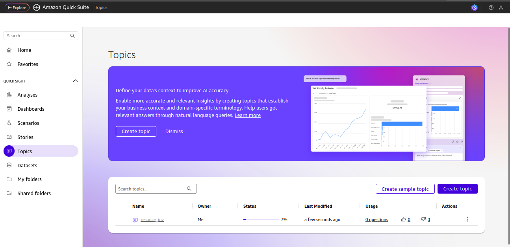

You can now ask natural language questions about your AWS resources.

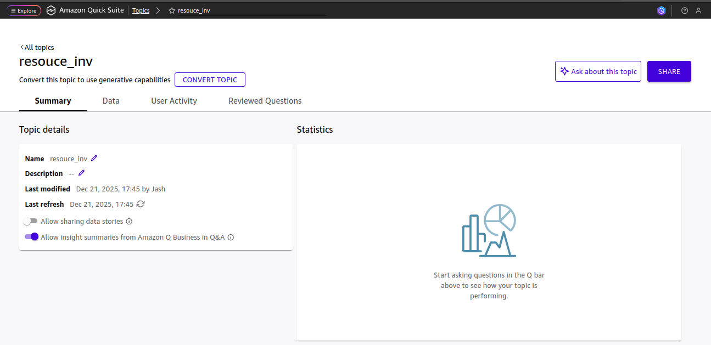

EC2-specific queries:

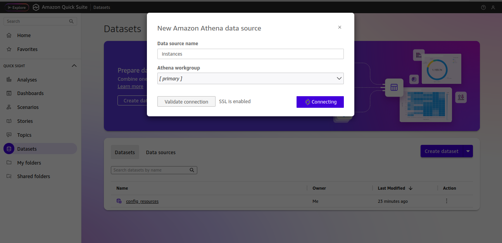
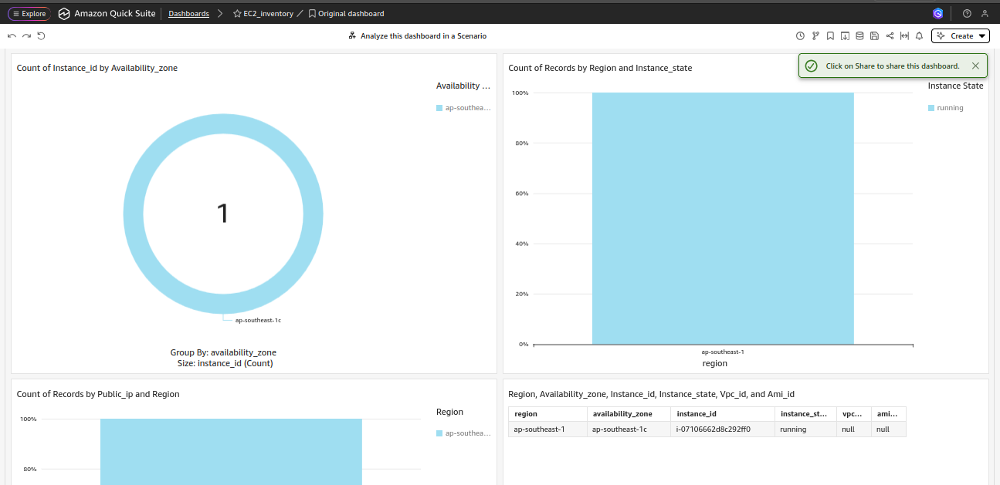

---

## Partition Management


### Automatic Partition Repair

```sql
MSCK REPAIR TABLE your_table_name;
```

### Manual Partition Creation

```sql
ALTER TABLE your_table_name
ADD IF NOT EXISTS PARTITION (
  region='ap-south-1',
  accountid='123456789012',
  year='2025',
  month='12',
  day='21'
)
LOCATION 's3://your-bucket/AWSLogs/123456789012/Config/ap-south-1/2025/12/21/';
```

---

Create an S3 Event notification to trigger lambda for update partitions in table.

Minimum IAM Permission required for the execution

```bash
{
  "Version": "2012-10-17",
  "Statement": [
    {
      "Effect": "Allow",
      "Action": [
        "athena:StartQueryExecution",
        "athena:GetQueryExecution",
        "athena:GetQueryResults"
      ],
      "Resource": "*"
    },
    {
      "Effect": "Allow",
      "Action": [
        "glue:GetTable",
        "glue:GetPartitions",
        "glue:CreatePartition"
      ],
      "Resource": "*"
    },
    {
      "Effect": "Allow",
      "Action": "s3:*",
      "Resource": "*"
    }
  ]
}
```

## Lambda Function for Table Update 

```python
import boto3
import time

athena = boto3.client("athena")

DATABASE = "your_database_name"
TABLE = "your_table_name"
OUTPUT = "s3://your-athena-query-results-bucket/"

def run_query(query):
    response = athena.start_query_execution(
        QueryString=query,
        QueryExecutionContext={"Database": DATABASE},
        ResultConfiguration={"OutputLocation": OUTPUT},
    )
    return response["QueryExecutionId"]

def lambda_handler(event, context):
    query = f"MSCK REPAIR TABLE {TABLE};"
    qid = run_query(query)
    return {"QueryExecutionId": qid}

   
```

