# Highly Available Web Application & Secure Networking Setup

## Overview

This project covers **Task 1** and **Task 3**, focusing on designing and deploying a highly available web application on AWS using best practices for scalability, availability, and secure networking.

- **Task 1:** Build a Highly Available Web Application using **Application Load Balancer (ALB)** and **EC2 Auto Scaling**
- **Task 3:** Deploy infrastructure using **AWS networking best practices**

All steps are supported with architecture diagrams and screenshots for clarity.

---

## Prerequisites

Before starting, ensure the following:

- An active **AWS Account**
- Basic understanding of:
  - Amazon EC2
  - VPC, Subnets, Route Tables
  - Load Balancers and Auto Scaling
- IAM user/role with permissions for:
  - EC2
  - VPC
  - Auto Scaling
  - Elastic Load Balancing
- SSH key pair for EC2 access
- Familiarity with Linux and basic web server setup (Apache/Nginx)

---

# Task 1: Highly Available Web Application Using ALB + EC2 Auto Scaling

## Architecture Diagram

Diagram representing the highly available web application setup:

---

## VPC Configuration

A custom VPC is created to host the application resources.

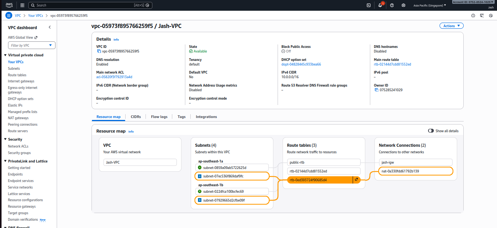

---

## EC2 Instance Setup

- Launch **2 EC2 instances** in **different Availability Zones**
- Install and configure **Apache or Nginx**
- Serve a simple static web page from each instance

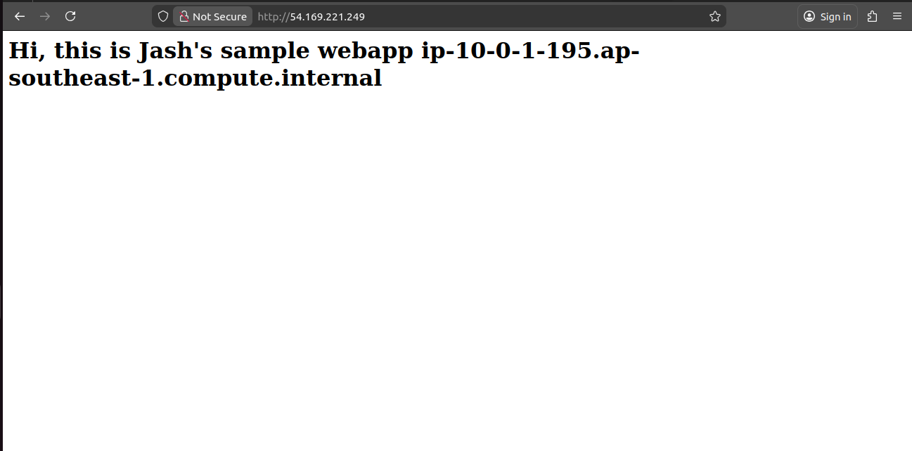

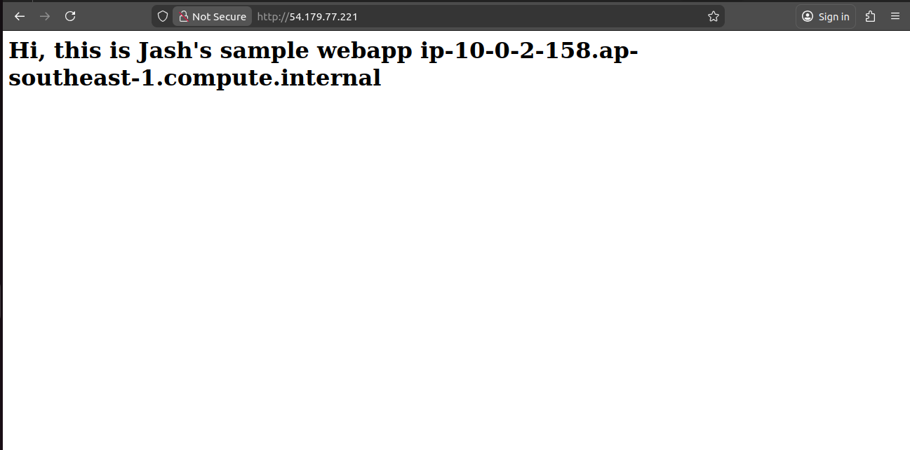

---

## Target Group Configuration

- Create a Target Group
- Register both EC2 instances
- Configure health checks to monitor instance health

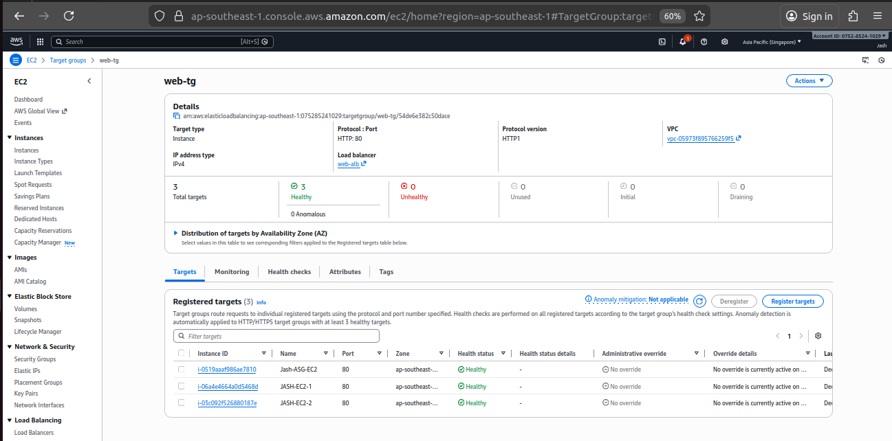

---

## Application Load Balancer (ALB)

- Create an **Application Load Balancer**
- Attach it to public subnets
- Associate it with the target group

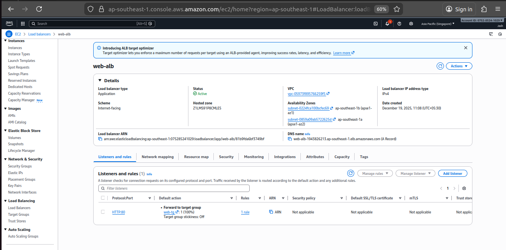

---

## Access Application Using ALB DNS

- Use the ALB DNS name to access the application
- Traffic is automatically distributed across healthy instances

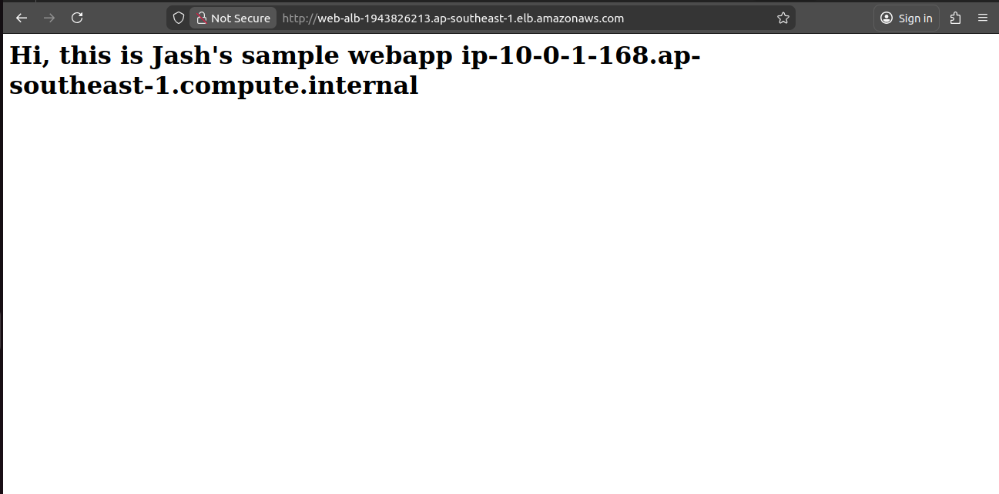

---

## Auto Scaling Group Configuration

Auto Scaling Group is configured with the following settings:

- **Minimum capacity:** 1
- **Maximum capacity:** 3
- **Scale out:** CPU utilization > 60%
- **Scale in:** CPU utilization < 20%

### Launch Template

The launch template defines instance configuration for scaling.

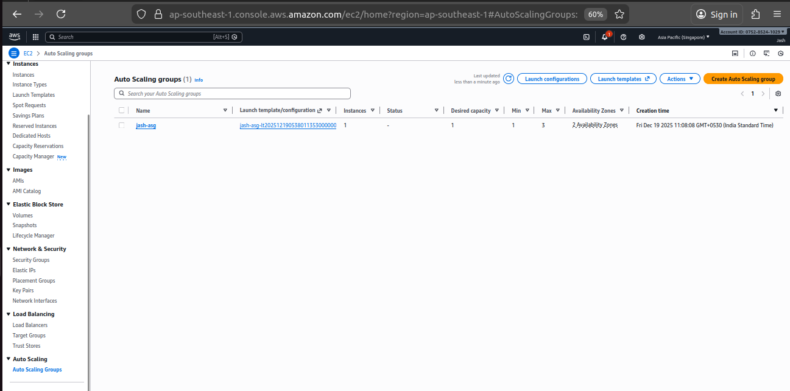

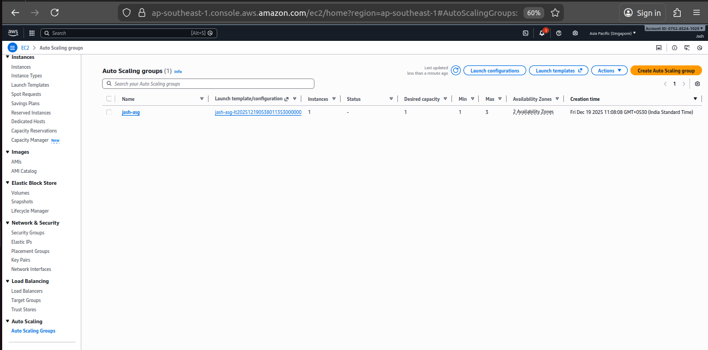

---

## Auto Scaling Validation

- Manually terminate one EC2 instance
- Auto Scaling Group automatically launches a new instance to maintain desired capacity

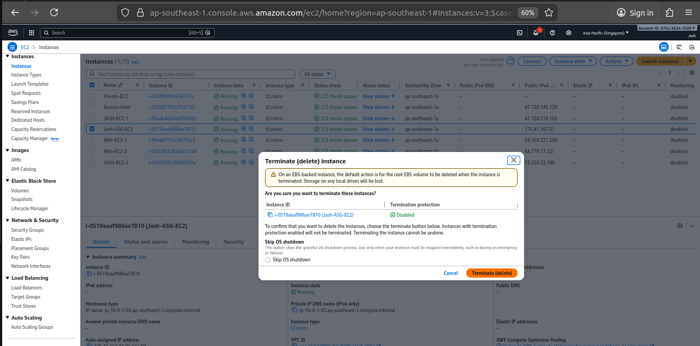

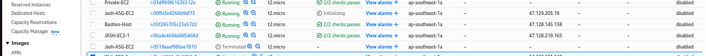

---

# Task 3: Infrastructure Deployment Using Networking Best Practices

## VPC and Subnet Design

- Create a VPC with:
  - **2 Public Subnets**
  - **2 Private Subnets**
- Subnets are distributed across multiple Availability Zones

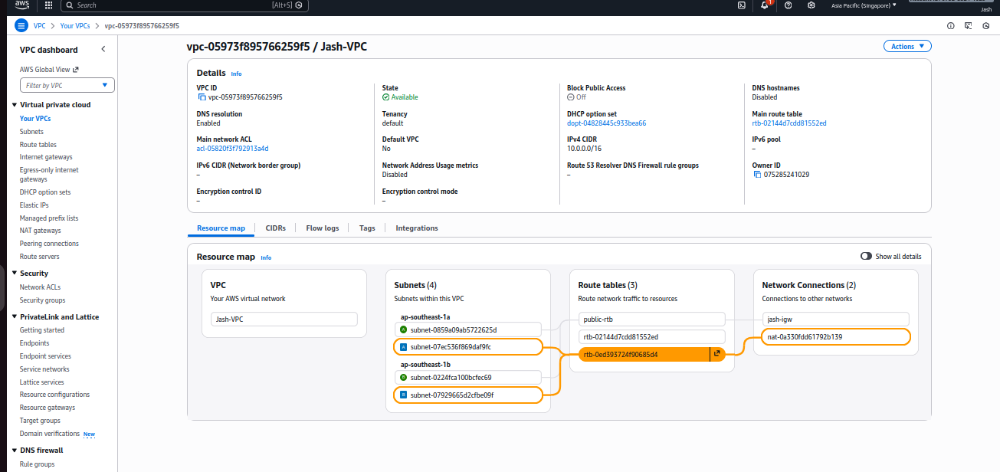

---

## Routing and Internet Access

- Configure **Internet Gateway** for public subnets
- Configure **NAT Gateway** for private subnets
- Associate appropriate route tables

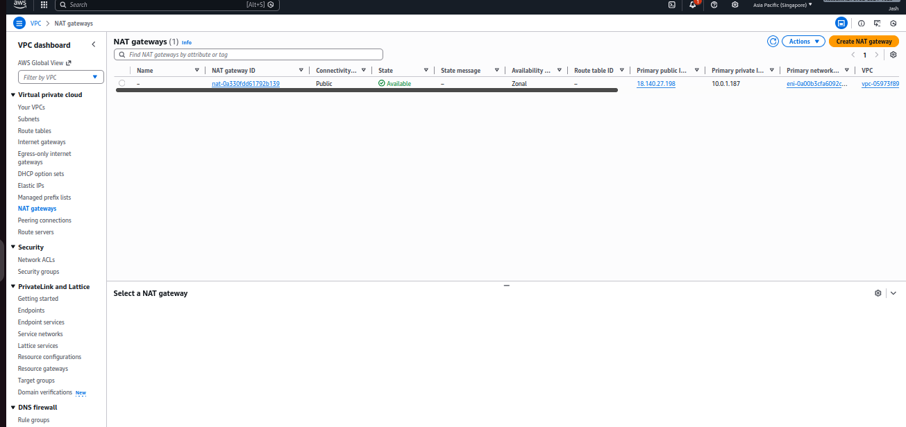

---

## Bastion Host Setup

- Launch a **public EC2 Bastion Host**
- Use it to securely SSH into private EC2 instances

---

## Clean-Up

- Terminate EC2 instances
- Delete Auto Scaling Groups and Load Balancer
- Remove NAT Gateway, subnets, and VPC to avoid unnecessary costs

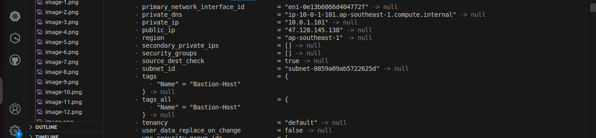

---

## Conclusion

This project demonstrates how to build a highly available, scalable, and secure web application on AWS using ALB, Auto Scaling, and proper VPC networking design. The architecture ensures fault tolerance, controlled access, and adherence to AWS best practices.